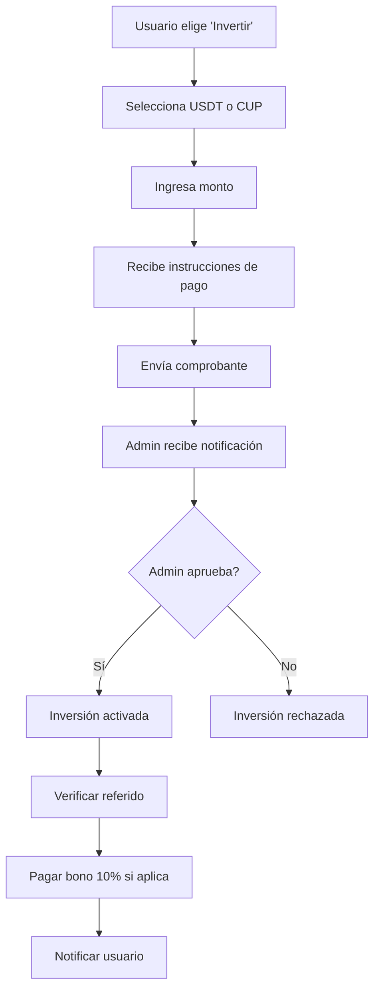
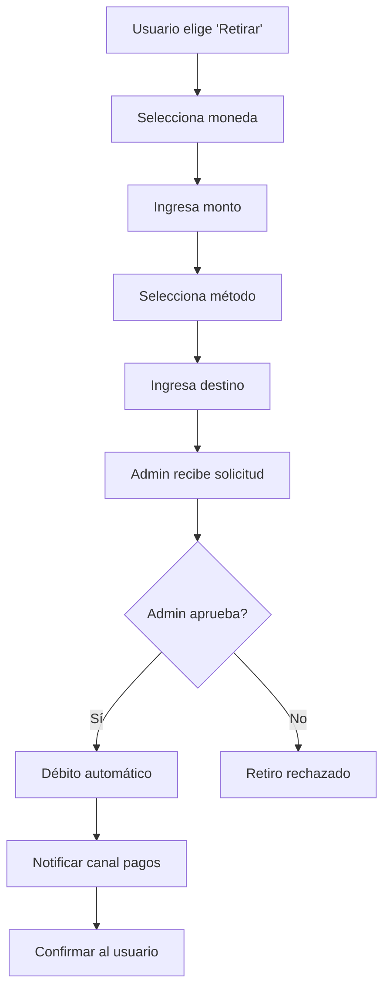

# 🤖 FortunaMoney Bot

Bot de Telegram para un sistema de inversiones con ganancias diarias y programa de referidos.

## 📋 Tabla de Contenidos

- [Características](#-características)
- [Configuración](#-configuración)
- [Funcionalidades](#-funcionalidades)
- [Base de Datos](#-base-de-datos)
- [Comandos de Usuario](#-comandos-de-usuario)
- [Comandos de Administrador](#-comandos-de-administrador)
- [Sistema de Referidos](#-sistema-de-referidos)
- [Flujo de Inversiones](#-flujo-de-inversiones)
- [Estructura del Código](#-estructura-del-código)

## 🌟 Características

### Inversiones
- **Múltiples monedas**: USDT (BEP20) y CUP (tarjetas cubanas)
- **Inversión mínima**: 25 USDT o 500 CUP
- **Ganancias diarias**: Basadas en tasa dinámica configurable
- **Tope máximo**: 500% del monto inicial
- **Inversiones individuales**: Cada depósito es una inversión independiente

### Sistema de Referidos
- **Bono del 10%**: Para el patrocinador cuando su referido invierte
- **Suma al progreso**: Los bonos se agregan directamente a las inversiones activas
- **Enlaces personalizados**: `https://t.me/bot?start=ref_USERID`

### Administración
- **Tasa dinámica**: Configurable diariamente por el admin
- **Aprobación manual**: Depósitos y retiros requieren confirmación
- **Pago automático**: Comando para pagar a todas las inversiones
- **Histórico completo**: Seguimiento de tasas y ganancias

## ⚙️ Configuración

### Variables de Entorno Requeridas

```env
# Bot de Telegram
BOT_TOKEN=tu_token_del_bot
WEBHOOK_SECRET=tu_secreto_webhook
HOST_URL=https://tu-dominio.com

# Base de Datos Supabase
SUPABASE_URL=https://tu-proyecto.supabase.co
SUPABASE_KEY=tu_api_key

# IDs de Telegram
ADMIN_ID=123456789
ADMIN_GROUP_ID=-1001234567890
PAYMENT_CHANNEL_ID=-1001234567890

# Wallets de Pago
WALLET_USDT=tu_wallet_usdt_bep20
WALLET_CUP=numero_tarjeta_cup

# Configuración del Negocio
MIN_INVERSION=25
RETIRO_FEE_USDT=1
CUP_USDT_RATE=400
PORT=3000
```

### Variables Opcionales

```env
# Valores por defecto si no se especifican
MIN_INVERSION=25          # Mínimo en USDT
RETIRO_FEE_USDT=1        # Fee de retiro en USDT
CUP_USDT_RATE=400        # 1 USDT = 400 CUP
PORT=3000                # Puerto del servidor
```

## 🚀 Funcionalidades

### Para Usuarios

#### 💰 Invertir
- **USDT (BEP20)**: Mínimo 25 USDT
- **CUP (Tarjeta)**: Mínimo 500 CUP
- **Proceso**: Seleccionar moneda → Ingresar monto → Enviar comprobante → Esperar aprobación

#### 💸 Retirar
- **USDT**: Fee de 1 USDT
- **CUP**: Sin fee
- **Proceso**: Seleccionar moneda → Ingresar monto → Ingresar destino → Esperar aprobación

#### 📊 Consultas
- **Saldo**: Ver todas las inversiones activas y progreso individual
- **Ganado total**: Histórico completo de ganancias
- **Tasa del día**: Porcentaje actual de ganancias
- **Histórico tasas**: Estadísticas mensuales con sumatoria

#### 👥 Referidos
- **Enlace personal**: Obtener enlace de referido
- **Bonos automáticos**: Recibir 10% por cada referido que invierta

### Para Administradores

#### 🎛️ Gestión de Tasas
- `/porcentajedeldia X` - Establecer nueva tasa y notificar usuarios
- `/porcentajehoy` - Consultar tasa actual
- `Histórico tasas` - Ver estadísticas detalladas por mes

#### 💳 Gestión de Depósitos
- **Aprobación/Rechazo**: Botones inline en el grupo admin
- **Verificación**: Revisión de comprobantes de pago
- **Activación automática**: Las inversiones se activan al aprobar

#### 🧾 Gestión de Retiros
- **Aprobación/Rechazo**: Botones inline en el grupo admin
- **Débito automático**: Se descuenta de saldos disponibles
- **Notificación**: Al canal de pagos para procesamiento

#### 📈 Pagos Diarios
- `/pagarhoy` - Pagar a todas las inversiones activas según la tasa del día
- **Distribución automática**: Calcula y distribuye ganancias
- **Notificación masiva**: Informa a usuarios sobre pagos recibidos

## 🗄️ Base de Datos

### Tablas Principales

#### `usuarios`
```sql
- telegram_id (bigint, PK)
- patrocinador_id (bigint, FK)
```

#### `depositos` (Inversiones)
```sql
- id (int, PK, auto)
- telegram_id (bigint, FK)
- monto (decimal) -- Monto en USDT equivalente
- moneda (text) -- 'USDT' o 'CUP'
- monto_origen (decimal) -- Monto original ingresado
- tasa_usdt (decimal) -- Tasa de conversión si es CUP
- estado (text) -- 'pendiente', 'aprobado', 'rechazado'
- ganado_disponible (decimal) -- Disponible para retirar
- ganado_total (decimal) -- Total ganado histórico
- fecha_creacion (timestamp)
- fecha_aprobacion (timestamp)
- es_bono_referido (boolean) -- Marca si es un bono
- proof_file_id (text) -- ID del comprobante en Telegram
```

#### `retiros`
```sql
- id (int, PK, auto)
- telegram_id (bigint, FK)
- monto (decimal)
- estado (text) -- 'pendiente', 'aprobado', 'rechazado'
- metodo (text) -- Método de pago
- moneda (text) -- 'USDT' o 'CUP'
- destino (text) -- Wallet o tarjeta destino
```

#### `carteras` (Solo para bonos USDT legacy)
```sql
- telegram_id (bigint, PK)
- saldo (decimal)
- bono (decimal)
- ganado_total (decimal)
```

#### `tasa_diaria`
```sql
- id (int, PK, auto)
- porcentaje (decimal)
- fecha (timestamp)
```

## 📱 Comandos de Usuario

### Menú Principal
- **Invertir** - Realizar nueva inversión
- **Retirar** - Solicitar retiro de ganancias
- **Saldo** - Ver inversiones activas y progreso
- **Referidos** - Obtener enlace de referido
- **Ganado total** - Histórico completo de ganancias
- **Tasa del día** - Consultar porcentaje actual
- **Histórico tasas** - Estadísticas mensuales

### Comandos de Texto
- `/start` - Iniciar el bot
- `/start ref_USERID` - Registrarse como referido
- `/menu` - Mostrar menú principal
- `/ayuda` o `/help` - Mostrar ayuda completa

## 🔧 Comandos de Administrador

### Gestión de Tasas
- `/porcentajedeldia 1.5` - Establecer tasa del día al 1.5%
- `/porcentajehoy` - Ver tasa actual

### Pagos y Procesamiento
- `/pagarhoy` - Ejecutar pago diario a todas las inversiones

### Aprobaciones (Botones Inline)
- **Depósitos**: `✅ Aprobar` / `❌ Rechazar`
- **Retiros**: `✅ Aprobar retiro` / `❌ Rechazar retiro`

## 👥 Sistema de Referidos

### Flujo Completo

1. **Generación de enlace**
   ```
   Usuario A usa "Referidos" → Obtiene: https://t.me/bot?start=ref_123456
   ```

2. **Registro de referido**
   ```
   Usuario B hace clic → /start ref_123456 → Se registra con patrocinador_id=123456
   ```

3. **Activación del bono**
   ```
   Usuario B invierte → Admin aprueba → Usuario A recibe 10% automáticamente
   ```

4. **Aplicación del bono**
   ```
   El 10% se suma directamente al progreso de las inversiones activas de Usuario A
   ```

### Características del Sistema
- **Automático**: No requiere intervención manual
- **Inteligente**: Se distribuye entre inversiones que no han alcanzado el tope
- **Inmediato**: Disponible para retirar inmediatamente
- **Progreso real**: Suma al `ganado_total` y `ganado_disponible`

## 💼 Flujo de Inversiones

### Proceso de Depósito



### Proceso de Retiro



### Cálculo de Ganancias Diarias

```javascript
// Ejemplo del comando /pagarhoy
const tasaDelDia = await obtenerPorcentajeDelDia(); // ej: 1.5%
const inversiones = await obtenerInversionesActivas();

for (const inv of inversiones) {
  const montoBase = inv.monto_origen; // ej: 100 USDT
  const tope = montoBase * 5; // 500 USDT (500%)
  const ganadoActual = inv.ganado_total; // ej: 250 USDT
  
  if (ganadoActual < tope) {
    const pago = montoBase * (tasaDelDia / 100); // 100 * 0.015 = 1.5 USDT
    const pagoFinal = Math.min(pago, tope - ganadoActual); // No exceder tope
    
    // Actualizar ganado_disponible y ganado_total
    await actualizarInversion(inv.id, pagoFinal);
  }
}
```

## 🏗️ Estructura del Código

### Funciones Principales

#### Gestión de Usuarios
- `asegurarUsuario(telegram_id, referido_por)` - Registra usuario con referido
- `inversionesDe(telegram_id, incluirBonos)` - Obtiene inversiones de usuario
- `saldosPorMoneda(telegram_id)` - Calcula saldos disponibles por moneda

#### Sistema de Bonos
- `aplicarBonoReferido(sponsorId, bonoMonto, moneda)` - Aplica bono a inversiones activas
- `carteraBonosDe(telegram_id)` - Obtiene bonos legacy en USDT
- `actualizarCarteraBonos(telegram_id, patch)` - Actualiza cartera de bonos

#### Gestión de Tasas
- `obtenerPorcentajeDelDia()` - Tasa actual
- `establecerPorcentajeDelDia(porcentaje)` - Establecer nueva tasa
- `notificarNuevaTasa(porcentaje)` - Notificar a usuarios activos
- `obtenerHistoricoTasas()` - Estadísticas por meses

#### Validaciones
- `topeAlcanzado(inversion)` - Verifica si llegó al 500%
- `progresoInversion(inversion)` - Calcula porcentaje de progreso
- `numero(x)` - Convierte a número seguro

### Handlers de Telegram

#### Comandos
- `bot.start()` - Maneja /start y referidos
- `bot.command('menu')` - Muestra menú
- `bot.command('ayuda')` - Ayuda completa
- `bot.command('pagarhoy')` - Pago diario (admin)
- `bot.command('porcentajedeldia')` - Establecer tasa (admin)

#### Botones del Menú
- `bot.hears('Invertir')` - Inicia proceso de inversión
- `bot.hears('Retirar')` - Inicia proceso de retiro
- `bot.hears('Saldo')` - Muestra saldos detallados
- `bot.hears('Referidos')` - Genera enlace de referido
- `bot.hears('Ganado total')` - Histórico de ganancias
- `bot.hears('Tasa del día')` - Muestra tasa actual
- `bot.hears('Histórico tasas')` - Estadísticas mensuales

#### Callbacks (Botones Inline)
- `dep:approve:ID` / `dep:reject:ID` - Aprobar/rechazar depósitos
- `ret:approve:ID` / `ret:reject:ID` - Aprobar/rechazar retiros
- `inv:usdt` / `inv:cup` - Seleccionar moneda para invertir
- `ret:moneda:USDT` / `ret:moneda:CUP` - Seleccionar moneda para retirar

#### Handlers de Contenido
- `bot.on('text')` - Procesa montos y destinos según estado
- `bot.on('photo')` - Recibe comprobantes de pago

## 🔄 Estados de Conversación

El bot mantiene estado por usuario para conversaciones multi-paso:

```javascript
const estado = {
  123456: 'INV_USDT',     // Esperando monto para inversión USDT
  789012: 'RET_CUP',      // Esperando monto para retiro CUP
  345678: 'RET_DEST'      // Esperando destino para retiro
};
```

### Estados Disponibles
- `INV_USDT` - Esperando monto de inversión en USDT
- `INV_CUP` - Esperando monto de inversión en CUP
- `RET_USDT` - Esperando monto de retiro en USDT
- `RET_CUP` - Esperando monto de retiro en CUP
- `RET_ELIGE_METODO` - Esperando selección de método de cobro
- `RET_DEST` - Esperando destino (wallet/tarjeta)

## 📊 Ejemplo de Uso Completo

### Escenario: Usuario nuevo con referido

1. **Juan recibe enlace**: `https://t.me/fortunamoneybot?start=ref_123456`

2. **Se registra**:
   ```
   Juan: /start ref_123456
   Bot: 🎉 ¡Bienvenido a FortunaMoney! Has sido referido por otro usuario.
   ```

3. **Invierte 100 USDT**:
   ```
   Juan: [Invertir] → USDT → 100
   Bot: ✅ Depósito creado. Envía el hash de transacción.
   Juan: [Envía comprobante]
   Admin: [Aprueba depósito]
   ```

4. **Referidor recibe bono**:
   ```
   Usuario 123456: 🎉 Bono de referido acreditado: 10.00 USDT
   Por el depósito de tu referido 789012.
   ```

5. **Ganancias diarias**:
   ```
   Admin: /porcentajedeldia 1.5
   [Al día siguiente]
   Admin: /pagarhoy
   Juan: 💸 Pago acreditado: 1.50 USDT (Tasa del día: 1.5%)
   ```

6. **Progreso hacia el 500%**:
   ```
   Juan: [Saldo]
   Bot: 📊 Tus Inversiones:
   💵 USDT:
     • Inv #123: 100.00 USDT
       Disponible: 11.50 USDT (10 bono + 1.5 ganancia)
       Progreso: 11.5%
   ```

## 🚨 Consideraciones de Seguridad

### Validaciones Implementadas
- **Anti auto-referido**: Un usuario no puede referirse a sí mismo
- **Validación de montos**: Mínimos y máximos configurables
- **Verificación de saldos**: No permite retiros superiores al disponible
- **Validación de admin**: Solo admin puede ejecutar comandos críticos
- **Manejo de errores**: Try-catch en todas las operaciones críticas

### Recomendaciones Adicionales
- **Rate limiting**: Implementar límites de requests por usuario
- **Logging completo**: Guardar todas las transacciones importantes
- **Backup automático**: Respaldar la base de datos regularmente
- **Monitoreo**: Alertas por operaciones sospechosas
- **SSL/TLS**: Usar HTTPS en todas las comunicaciones

## 🔧 Mantenimiento

### Logs Importantes
```javascript
console.log('[BONO] sponsorId para', d.telegram_id, '=>', sponsorId);
console.log(`[BONO] Distribuidos ${bonoMonto} ${moneda} entre ${inversionesActivas.length} inversiones`);
console.log(`Inv #${inv.id}: +${pago.toFixed(2)} ${moneda} (tasa ${tasaDelDia}%)`);
```

### Monitoreo Recomendado
- **Errores de webhook**: Verificar conectividad con Telegram
- **Errores de Supabase**: Verificar conexión a base de datos
- **Pagos pendientes**: Revisar aprobaciones pendientes diariamente
- **Tasas del día**: Confirmar que se establece diariamente

---

## 📝 Notas de Desarrollo

- **Framework**: Node.js con Telegraf
- **Base de datos**: Supabase (PostgreSQL)
- **Hosting**: Compatible con Railway, Render, Heroku
- **Webhook**: Configuración automática en startup
- **Estado**: Almacenado en memoria (se pierde al reiniciar)

Para más información técnica, revisar el código fuente en `index.js`.
